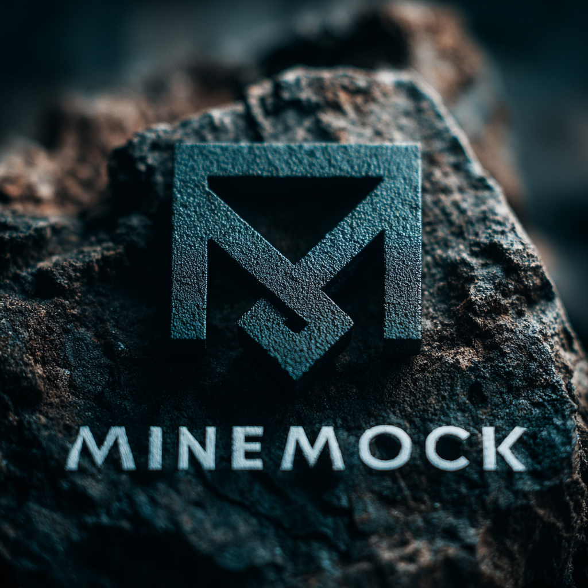

# MineMock

A harmless cryptocurrency miner simulator for detection testing. Generates realistic mining-like artifacts without consuming resources or connecting to actual pools.

## What is MineMock

MineMock is a small Golang tool that imitates the behavior patterns of cryptocurrency mining software without performing any actual mining. It simulates CPU load patterns, creates network connections to common mining pool addresses, and mimics command-line arguments used by popular miners (XMRig, CGMiner, etc.) — all without wasting electricity, generating profit, or participating in botnet activity.

## Features

- **Realistic CPU patterns** — Generates configurable CPU load spikes that resemble mining algorithms
- **Pool connection simulation** — Opens TCP connections to well-known mining pool domains/IPs (simulated only — no actual pool protocol traffic)
- **Command-line mimicry** — Accepts common miner flags like `-o` (pool), `-u` (wallet/user), `-p` (password), `-t` (threads)
- **Process disguise** — Optionally rename process to common miner names (`xmrig`, `minerd`, `system-update`)
- **No actual mining** — No Stratum protocol, no hash calculations, no wallet addresses validated

## Purpose

Detection engineering for crypto-mining threats requires:

- Realistic process behavior patterns
- Suspicious network connection artifacts (to pools like `pool.minexmr.com`, `xmr.pool.minergate.com`)
- High CPU usage signatures
- Command-line patterns with suspicious flags

Using real mining software in enterprise environments risks actual resource abuse and security policy violations. MineMock provides the detection artifacts without the risk.

## Build

MineMock is pure Go and can be built or cross-compiled easily.  
Requires **Go 1.20+**.

### Build for the current platform

```bash
go build -o minemock minemock.go
```

### Cross-compile for Windows

```bash
GOOS=windows GOARCH=amd64 go build -o minemock_windows_amd64.exe minemock.go
GOOS=windows GOARCH=arm64 go build -o minemock_windows_arm64.exe minemock.go
```

### Cross-compile for macOS

```bash
GOOS=darwin GOARCH=amd64 go build -o minemock_darwin_amd64 minemock.go
GOOS=darwin GOARCH=arm64 go build -o minemock_darwin_arm64 minemock.go
```

### Unified build script (`build.sh`)

The repository includes a convenience script that builds all supported platforms in one run.

Make executable:

```bash
chmod +x build.sh
```

Run:

```bash
./build.sh
```

## Usage Examples

Simulate XMRig-like behavior:

```bash
minemock -o pool.minexmr.com:4444 -u 44abcd...wallet -p x -t 4 --donate-level=1
```

Simulate with custom CPU load pattern:

```bash
minemock -o stratum+tcp://xmr.pool.minergate.com:45700 -u worker@evil.com -t 8 --cpu-load=75 --duration=300
```

Background mode (common in actual attacks):

```bash
nohup ./minemock -o pool.supportxmr.com:3333 -u 44... -p x -B > /dev/null 2>&1 &
```

## Relevant Sigma Rules

MineMock is designed to mimic common cryptocurrency miner command-line patterns and network behaviors without performing harmful resource consumption.

When used in detection pipelines, it can help validate rules that look for:

- Suspicious miner process names
- Connections to known mining pools
- High CPU usage patterns
- Command-line patterns with wallet addresses

## License

MIT
