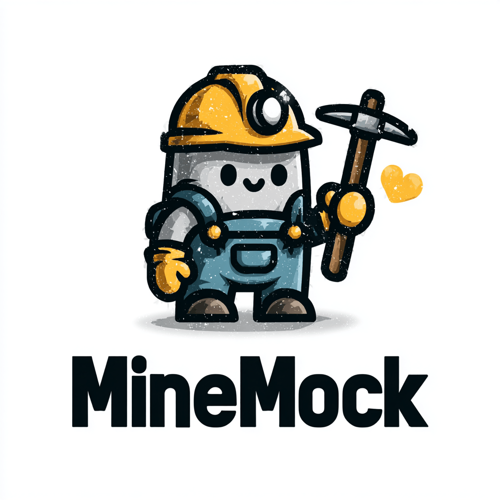

# MineMock

A harmless cryptocurrency miner simulator for detection testing. Generates realistic mining-like artifacts without consuming resources or connecting to actual pools.

## What is MineMock

MineMock is a small Golang tool that imitates the behavior patterns of cryptocurrency mining software without performing any actual mining. It simulates CPU load patterns, creates network connections to common mining pool addresses, and mimics command-line arguments used by popular miners (XMRig, CGMiner, etc.) — all without wasting electricity, generating profit, or participating in botnet activity.

## Quick Start (3 Steps)

Get up and running with MineMock in under a minute:

### Step 1: Download the Binary

**Windows (PowerShell):**
```powershell
# Download the latest release (adjust architecture if needed: amd64 or arm64)
Invoke-WebRequest -Uri "https://github.com/RuneBot14/minemock/releases/latest/download/minemock_windows_amd64.exe" -OutFile "minemock.exe"
```

**Linux (Bash):**
```bash
# Download the latest release (adjust architecture if needed: amd64 or arm64)
curl -L -o minemock "https://github.com/RuneBot14/minemock/releases/latest/download/minemock_linux_amd64"
chmod +x minemock
```

### Step 2: See the Examples

Run the help command to see ready-to-use examples:

**Windows:**
```powershell
.\minemock.exe -h
```

**Linux:**
```bash
./minemock -h
```

Look for the "Ready-to-Use Examples" section in the output — you'll see 3 copy-pasteable command lines with realistic pool addresses and wallet addresses.

### Step 3: Run an Example

Copy one of the examples from the help output and paste it into your terminal. For example:

**Windows:**
```powershell
.\minemock.exe -o pool.supportxmr.com:3333 -u 44abcd...wallet -t 4 --cpu-load=50
```

**Linux:**
```bash
./minemock -o pool.supportxmr.com:3333 -u 44abcd...wallet -t 4 --cpu-load=50
```

That's it! MineMock is now running and generating realistic mining artifacts for your detection tests. Press `Ctrl+C` to stop.

## Features

- **Realistic CPU patterns** — Generates configurable CPU load spikes that resemble mining algorithms
- **Pool connection simulation** — Opens TCP connections to well-known mining pool domains/IPs
- **Stratum protocol simulation** — Optional full Stratum protocol handshake (`--stratum` flag)
  - `mining.subscribe` — Subscribe to pool
  - `mining.authorize` — Authenticate worker
  - `mining.notify` — Receive job notifications
  - `mining.submit` — Submit simulated shares
  - `mining.set_difficulty` — Handle difficulty adjustments
- **Command-line mimicry** — Accepts common miner flags like `-o` (pool), `-u` (wallet/user), `-p` (password), `-t` (threads)
- **Built-in pool list** — Reference list of top 10 mining pools (`--list-pools`)
- **Wallet address generator** — Generate realistic test addresses (`gen-address` command)
- **Ready-to-Use Examples** — Run `minemock -h` to get 3 random, copy-pasteable command lines with realistic pool addresses, wallet addresses, and CPU load settings
- **No actual mining** — No hash calculations, no wallet addresses validated, no real shares submitted

## Purpose

Detection engineering for crypto-mining threats requires:

- Realistic process behavior patterns
- Suspicious network connection artifacts (to pools like `pool.supportxmr.com`, `xmrpool.eu`)
- High CPU usage signatures
- Command-line patterns with wallet addresses
- **Stratum protocol detection** — Network signatures for JSON-RPC mining protocol

Using real mining software in enterprise environments risks actual resource abuse and security policy violations. MineMock provides the detection artifacts without the risk.

## Build

MineMock is pure Go and can be built or cross-compiled easily.  
Requires **Go 1.20+**.

### Build for the current platform

```bash
go build -o minemock minemock.go
```

### Cross-compile for Windows

```bash
GOOS=windows GOARCH=amd64 go build -o minemock_windows_amd64.exe minemock.go
GOOS=windows GOARCH=arm64 go build -o minemock_windows_arm64.exe minemock.go
```

### Cross-compile for macOS

```bash
GOOS=darwin GOARCH=amd64 go build -o minemock_darwin_amd64 minemock.go
GOOS=darwin GOARCH=arm64 go build -o minemock_darwin_arm64 minemock.go
```

### Unified build script (`build.sh`)

The repository includes a convenience script that builds all supported platforms in one run.

Make executable:

```bash
chmod +x build.sh
```

Run:

```bash
./build.sh
```

## Usage Examples

### 🚀 Quick Start — Ready-to-Use Examples

The easiest way to get started: just run the help command and copy-paste one of the ready-to-use examples!

```bash
minemock -h
```

This will display **3 randomized, copy-pasteable command lines** featuring:
- A random mining pool from the top 10 list
- A randomly generated wallet address (realistic-looking but invalid)
- Random CPU load (20-80%)
- `--donate-level=0` (because malware authors are greedy!)

**Example output:**
```
Ready-to-Use Examples (copy & paste):
  minemock -o xmr.c3pool.org:3333 -u 4pDTu2yX1Mu9NkL6oozZxNXLMRR8Gyo226BNnt19Jqc6EoNYtcPvhuWwooUPR3FJKSXFwWVpQ2yGdUzYtujq3XxBGzDvEbd -t 3 --cpu-load=45 --donate-level=0
  minemock -o xmr.hashvault.pro:3333 -u 4dBUoiXWyodL1t3yG4wCWrBVxmfMzuPjN6VqBCP9tzHc94vxpN7sx26k2HcZLX9PKPiUWoK3eQhRLDRNfWvZkxyddMgLGk9 -t 5 --cpu-load=67 --donate-level=0
  minemock -o pool.minexmr.com:4444 -u 4DsXj3ZSiRr6y2bGMhYZ7xYSxG8KqJxe6Argfmc7CNwT2hZmbz5AKf25jvpBaf39pE3J5Pn1XKMoNtFDrqsrRajpTNxckGC -t 2 --cpu-load=47 --donate-level=0
```

Just copy one of these lines and paste it into your terminal for instant suspicious-looking activity! 🎯

### Generate test wallet addresses

```bash
minemock gen-address
```

Generates realistic-looking (but invalid) Monero wallet addresses for testing:
- Standard addresses (95 chars, starts with '4')
- Subaddresses (95 chars, starts with '8')  
- Integrated addresses (106 chars, starts with '4')

### List top mining pools

```bash
minemock --list-pools
```

### Basic simulation (TCP connection only)

```bash
minemock -o pool.supportxmr.com:3333 -u 44abcd...wallet -p x -t 4
```

### Full Stratum protocol simulation

```bash
minemock -o pool.supportxmr.com:3333 -u 44abcd...wallet -p x -t 4 --stratum -v
```

This enables:
- JSON-RPC Stratum handshake
- Periodic share submissions (simulated)
- Job notification handling
- Keepalive traffic

### Custom CPU load pattern

```bash
minemock -o xmrpool.eu:3333 -u worker@evil.com -t 8 --cpu-load=75 --duration=300 --stratum
```

### Background mode (common in actual attacks)

```bash
nohup ./minemock -o pool.supportxmr.com:3333 -u 44... -p x -t 4 --stratum -B > /dev/null 2>&1 &
```

## Network Detection Testing

### Stratum Protocol Signatures

When using `--stratum`, MineMock generates realistic Stratum protocol traffic:

**Outgoing (Client → Pool):**
```json
{"id":1,"method":"mining.subscribe","params":["MineMock/1.0"]}
{"id":2,"method":"mining.authorize","params":["WALLET.worker","x"]}
{"id":10,"method":"mining.submit","params":["worker","nonce","hash"]}
```

**Incoming (Pool → Client):**
```json
{"id":null,"method":"mining.notify","params":[...]}
{"id":null,"method":"mining.set_difficulty","params":[...]}
```

These patterns can be used to test:
- IDS/IPS rules for Stratum protocol detection
- Network traffic analysis for mining pool connections
- Behavioral analytics for periodic share submission patterns

## Relevant Sigma Rules

MineMock is designed to mimic common cryptocurrency miner command-line patterns and network behaviors without performing harmful resource consumption.

When used in detection pipelines, it can help validate rules that look for:

- Suspicious miner process names
- Connections to known mining pools
- High CPU usage patterns
- Command-line patterns with wallet addresses
- **Stratum protocol over non-standard ports**

## Top Mining Pools Reference

MineMock includes a built-in list of commonly used mining pools:

| # | Name | Address | Port | Algorithm |
|---|------|---------|------|-----------|
| 1 | supportxmr | pool.supportxmr.com | 3333 | RandomX |
| 2 | xmrpool | xmrpool.eu | 3333 | RandomX |
| 3 | moneroocean | gulf.moneroocean.stream | 10128 | Auto |
| 4 | nanopool | xmr-eu1.nanopool.org | 10300 | RandomX |
| 5 | c3pool | xmr.c3pool.org | 3333 | RandomX |
| 6 | minexmr | pool.minexmr.com | 4444 | RandomX |
| 7 | hashvault | xmr.hashvault.pro | 3333 | RandomX |
| 8 | herominers | xmr.herominers.com | 10191 | RandomX |
| 9 | kryptex | xmr.kryptex.network | 3333 | RandomX |
| 10 | unmineable | rx.unmineable.com | 3333 | RandomX |

## License

MIT
